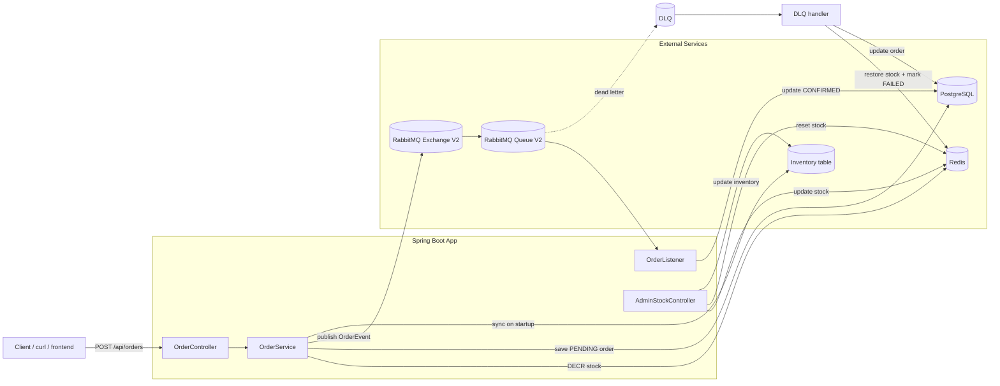
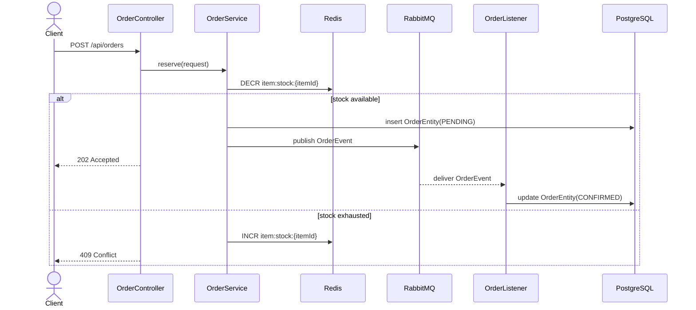

# Flash Sale PoC

This project is a small Spring Boot backend that simulates a flash-sale reservation flow.

It uses:

- Java 25
- Spring Boot 4.1.0
- PostgreSQL
- Redis
- RabbitMQ

## Architecture

### High-level flow



### Request sequence



## How it works

The app has one public endpoint:

- `POST /api/orders`
- `GET /api/orders/{id}`

When a request comes in:

1. The controller receives the request.
2. The service decrements stock in Redis.
3. If stock is available, the service saves a `PENDING` order in PostgreSQL.
4. The service publishes an order event to RabbitMQ.
5. The listener consumes the event and marks the order `CONFIRMED`.
6. If a message reaches the DLQ, the DLQ handler restores Redis stock and marks the order `FAILED`.

You can fetch the order by ID with `GET /api/orders/{id}` to show the state after the queue has processed it.
You can also set `"forceFail": true` on the order request to intentionally send the message through the DLQ path for the demo.

Redis is the fast stock gate. PostgreSQL is the durable order store. RabbitMQ sits in between so request handling stays fast.
The inventory row in PostgreSQL is the source of truth for available stock; Redis mirrors that value for fast reservation checks.

On startup, the app seeds Redis with `item:stock:1 = 10` when the key is missing.

If you run with the `dev` profile, the app resets that stock on every startup.

The real inventory is also stored in PostgreSQL, so Redis is synced from the inventory table instead of being the only place that knows the stock value.

The stock write path is shared by the startup seeder and the admin endpoint through `InventoryService`.

The RabbitMQ resources use the `V2` names to avoid conflicts with older queues:

- `flashSaleExchangeV2`
- `flashSaleQueueV2`
- `flashSaleDlqExchangeV2`

## Prerequisites

Install:

- Java 25
- Maven 3.9.x or newer
- Docker
- Docker Compose

If your shell needs it, set:

```bash
export JAVA_HOME=/usr/lib/jvm/java-25-openjdk-amd64
```

If you want to avoid the older system Maven, use the local Maven install:

```bash
export PATH=/home/miguez/.local/maven/bin:$PATH
```

## Run locally

1. Start the infrastructure:

```bash
docker compose up -d
```

2. Start the app:

```bash
SPRING_PROFILES_ACTIVE=dev mvn spring-boot:run
```

3. Run tests:

```bash
mvn test
```

## API

Successful reservation:

```bash
curl -i -X POST http://localhost:8080/api/orders \
  -H "Content-Type: application/json" \
  -d '{"itemId":1,"userId":123,"forceFail":false}'
```

Forced failure for DLQ demo:

```bash
curl -i -X POST http://localhost:8080/api/orders \
  -H "Content-Type: application/json" \
  -d '{"itemId":1,"userId":123,"forceFail":true}'
```

Fetch order by ID:

```bash
curl -i http://localhost:8080/api/orders/{id}
```

Expected responses:

- `202 Accepted` if stock was reserved
- `409 Conflict` if stock is exhausted
- `400 Bad Request` if validation fails

To adjust stock manually:

```bash
curl -X POST http://localhost:8080/api/admin/stock/1 \
  -H "Content-Type: application/json" \
  -d '{"availableQuantity":9}'
```

This updates both PostgreSQL inventory and Redis stock.

To inspect stock:

```bash
curl -i http://localhost:8080/api/admin/stock/1
```

The response shows both the PostgreSQL inventory value and the current Redis value.

To reset stock for an item during development:

```bash
curl -X POST http://localhost:8080/api/admin/stock/1/reset \
  -H "Content-Type: application/json" \
  -d '{"quantity":10}'
```

This updates both PostgreSQL inventory and Redis stock.

## Configuration

Runtime settings live in [`src/main/resources/application.yml`](src/main/resources/application.yml).

Defaults:

- PostgreSQL: `localhost:5432`
- Redis: `localhost:6379`
- RabbitMQ: `localhost:5672`
- Default Redis stock: `item:stock:1 = 10`
- Dead-letter queue: `flashSaleQueueV2.dlq`

## Project structure

- [`src/main/java/com/example/flashsale/FlashSalePocApplication.java`](src/main/java/com/example/flashsale/FlashSalePocApplication.java) - app entry point
- [`src/main/java/com/example/flashsale/controller/OrderController.java`](src/main/java/com/example/flashsale/controller/OrderController.java) - HTTP API
- [`src/main/java/com/example/flashsale/dto/OrderResponse.java`](src/main/java/com/example/flashsale/dto/OrderResponse.java) - order lookup response
- [`src/main/java/com/example/flashsale/service/OrderService.java`](src/main/java/com/example/flashsale/service/OrderService.java) - reservation logic
- [`src/main/java/com/example/flashsale/service/InventoryService.java`](src/main/java/com/example/flashsale/service/InventoryService.java) - shared inventory sync logic
- [`src/main/java/com/example/flashsale/service/OrderListener.java`](src/main/java/com/example/flashsale/service/OrderListener.java) - RabbitMQ consumer
- [`src/main/java/com/example/flashsale/model/OrderEntity.java`](src/main/java/com/example/flashsale/model/OrderEntity.java) - PostgreSQL entity
- [`src/main/java/com/example/flashsale/model/InventoryEntity.java`](src/main/java/com/example/flashsale/model/InventoryEntity.java) - inventory entity
- [`src/main/java/com/example/flashsale/dto/InventoryStatusResponse.java`](src/main/java/com/example/flashsale/dto/InventoryStatusResponse.java) - stock inspection response
- [`src/main/java/com/example/flashsale/repository/OrderRepository.java`](src/main/java/com/example/flashsale/repository/OrderRepository.java) - JPA repository
- [`src/main/java/com/example/flashsale/repository/InventoryRepository.java`](src/main/java/com/example/flashsale/repository/InventoryRepository.java) - inventory repository
- [`src/main/java/com/example/flashsale/config/StockDataInitializer.java`](src/main/java/com/example/flashsale/config/StockDataInitializer.java) - Redis stock seeder
- [`src/main/java/com/example/flashsale/controller/AdminStockController.java`](src/main/java/com/example/flashsale/controller/AdminStockController.java) - stock adjustment API

## For juniors

If you come from React, Node, and Supabase:

- `@RestController` is like an Express route handler.
- `@Service` is your business logic layer.
- `@Repository` is your data access layer.
- `@Entity` maps a class to a database table.
- Redis here is a fast in-memory counter.
- RabbitMQ is the queue that buffers work.
- PostgreSQL is the durable database.
- The inventory table is the durable source of truth for available stock.

The important idea is:

- check stock fast
- accept or reject the request quickly
- save the order immediately as `PENDING`
- confirm it later through the queue
- keep Redis in sync with the durable inventory data

## Troubleshooting

- If Maven complains about `JAVA_HOME`, point it to your Java 25 JDK.
- If you get `409 Conflict`, it usually means Redis stock is exhausted or the inventory value needs to be updated.
- If RabbitMQ or the listener fails, the message can land in the dead-letter queue and the stock is restored there.
